# Diffusion World Model for Robotics

**Master's thesis, University of Tartu, 2026**

This repository contains the code and experiments for a diffusion-style world model for robot manipulation. The model does not predict pixels directly. It encodes video frames with a frozen DINOv2 encoder, predicts future semantic patch features with a 400M parameter spatial-temporal transformer, and uses those imagined latent rollouts for offline goal-conditioned planning.

I built the full stack around the idea: UR5 data recording through LeRobot and RTDE, dataset converters for mixed video training, DINOv2/RAE encoding and decoding, distributed world-model training, held-out rollout evaluation, and a Cross-Entropy Method planner over UR5 end-effector actions.

<p align="center">
  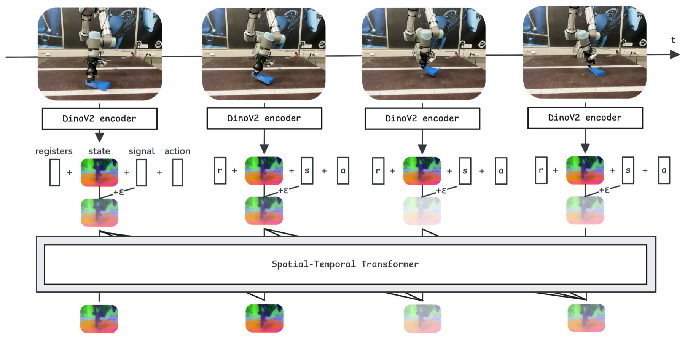
</p>

[Thesis PDF](thesis/thesis.pdf) | [Thesis source](thesis/thesis.tex)

## Core Question

The final thesis focuses on a recorded UR5 target domain and a concrete evaluation question:

> Can a world model trained in a frozen semantic visual representation use both passive video and action-labeled robot data to produce stable action-conditioned rollouts, and can those rollouts be useful for offline visual planning?

The target robot dataset is intentionally small: around two hours of UR5 interaction data with 10 tabletop objects, varied camera viewpoints, and no fixed imitation task. The rest of the training signal comes from mixed video: BridgeData V2, EPIC-KITCHENS, and DROID. After temporal resampling and selection, the training corpus is roughly 1,000 hours at 5 Hz.

## System

| Component | Final setup |
|---|---|
| Visual state | Frozen DINOv2-base patch features |
| Per-frame latent | `16 x 16` patch grid, 768 features per patch, 196,608 scalars total |
| Decoder | RAE decoder, used only for visualization |
| World model | 24-block block-causal transformer, width 1024, 16 heads, about 400M parameters |
| Attention | Spatial layers within each frame, causal temporal layers across frames |
| Context | 24 frames at 5 Hz, so 4.8 seconds of temporal memory |
| Action token | 7D relative local UR5 end-effector delta: translation, rotation vector, gripper |
| Training objective | Diffusion Forcing / flow matching velocity loss in DINO feature space |
| Rollout | Euler denoising with KV caching, generated latents fed back at signal level 0.8 |
| Planning | CEM over action sequences, scored by terminal DINO feature distance plus action penalty |

The token layout per frame is:

```text
[signal | action | register_1..register_4 | 256 DINO patch tokens]
```

Action-free video uses the same layout. When no action is available, the action position stays as a learned base token. This made it possible to train one model from both action-labeled UR5 data and passive video without changing the input interface halfway through training.

## Training Data

| Dataset | Weight in final mixture | Actions | Role |
|---|---:|---|---|
| UR5 recordings | 25% | yes | Target robot embodiment and action-conditioned transitions |
| BridgeData V2 | 15% | no | Robot manipulation video from a different setup |
| EPIC-KITCHENS | 30% | no | Human-object interaction and contact-rich egocentric video |
| DROID | 30% | no | Diverse in-the-wild robot manipulation video |

Training used distributed data parallelism, bfloat16 autocast, AdamW, gradient clipping, and four NVIDIA H200 GPUs on the University of Tartu UT Rocket cluster.

## Results

All quantitative results below are held-out UR5 evaluation results. Metrics are mean squared error in normalized DINO latent space, averaged over patch tokens and feature dimensions. Lower is better.

### Mixed Video Delayed Overfitting

The UR5-only model reached its best checkpoint after only 2,000 optimizer steps and then overfit. Adding external robot and human-interaction video let training continue much longer and improved rollout quality.

<p align="center">
  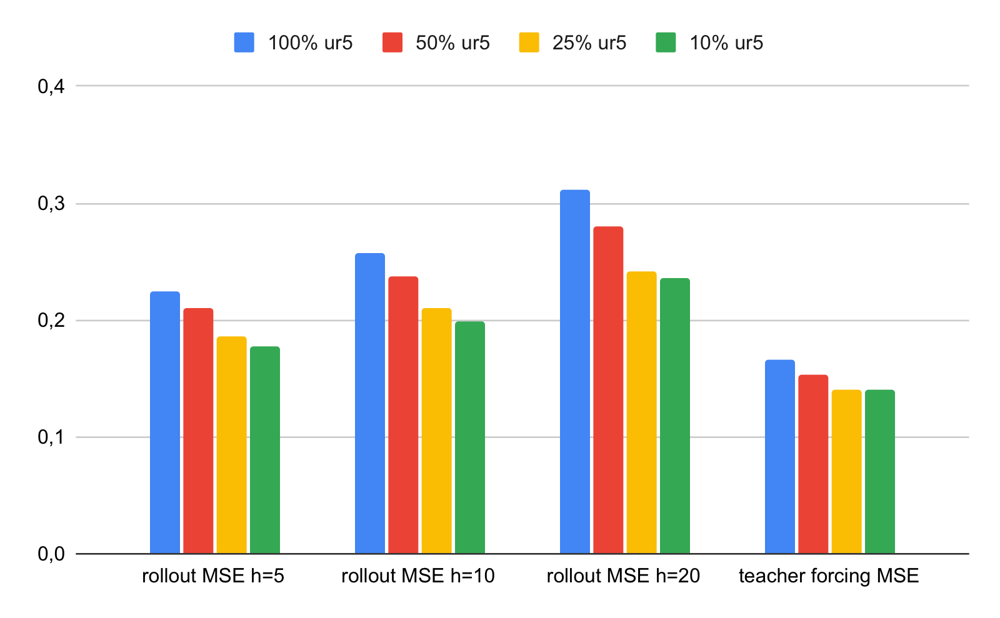
</p>

| Training mixture | Best step | Teacher forcing | Rollout H=5 | Rollout H=10 | Rollout H=20 |
|---|---:|---:|---:|---:|---:|
| UR5 only | 2,000 | 0.166 | 0.224 | 0.257 | 0.312 |
| 50% UR5, 50% mixed | 5,500 | 0.153 | 0.210 | 0.238 | 0.280 |
| 25% UR5, 75% mixed | 15,500 | **0.141** | 0.186 | 0.210 | 0.242 |
| 10% UR5, 90% mixed | 35,500 | 0.148 | **0.178** | **0.199** | **0.236** |

The 10% UR5 mixture gave the lowest rollout errors, but it took more than twice as many steps as the 25% UR5 setting and slightly worsened one-step prediction. For this model size and compute budget, 25% UR5 was the better practical tradeoff.

### High-Dimensional DINO Latents Needed Their Own Noise Schedule

A DINO frame is much larger than a compact VAE latent. The final model used a resolution-shifted signal schedule that samples more heavily from low signal levels, where the input is closer to noise.

<p align="center">
  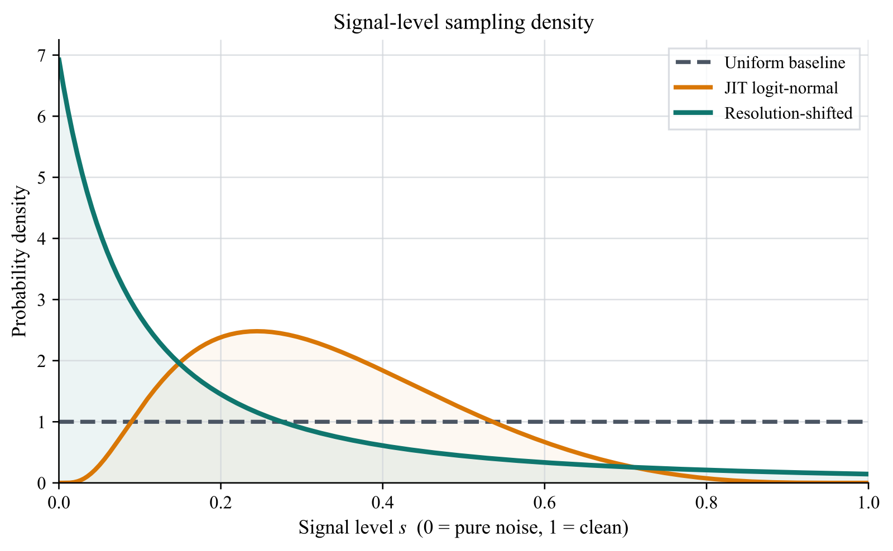
</p>

| Signal schedule | Best step | Teacher forcing | Rollout H=5 | Rollout H=10 | Rollout H=20 |
|---|---:|---:|---:|---:|---:|
| Uniform | 15,500 | 0.142 | 0.213 | 0.245 | 0.283 |
| Logit-normal | 16,000 | **0.141** | 0.205 | 0.232 | 0.263 |
| Resolution-shifted | 15,500 | **0.141** | **0.186** | **0.210** | **0.242** |

The one-step teacher-forced numbers look almost identical for logit-normal and resolution-shifted training. The difference appears once predictions are fed back autoregressively: the resolution-shifted schedule is clearly better at longer horizons.

### Clean Feedback Was Not Best

During rollout, generated latents are inserted back into the temporal cache. Feeding them back as perfectly clean states was worse than adding a controlled amount of corruption. The best long-horizon result came from signal level `0.8`.

<p align="center">
  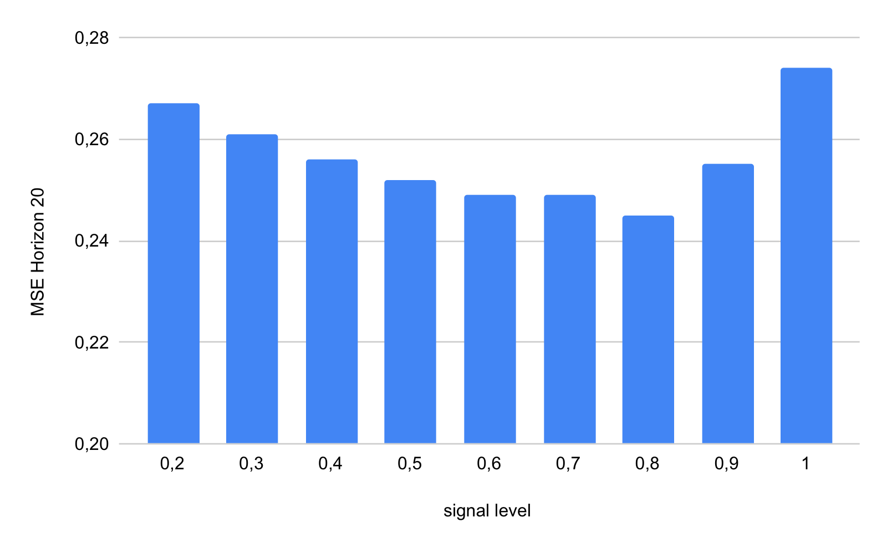
</p>

This was a useful finding because it goes against the obvious default. In this high-dimensional DINO space, partially corrupted generated history kept the rollout distribution closer to what the model saw during Diffusion Forcing training.

### Action-Conditioned Rollouts Stayed Coherent

For qualitative evaluation, the model receives 10 clean context frames, then only the future UR5 action sequence. The rollout is decoded with the RAE decoder for inspection; training and metrics stay entirely in DINO feature space.

<p align="center">
  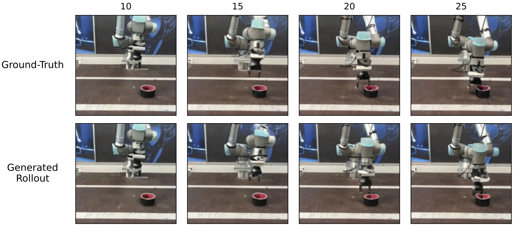
</p>

<p align="center">
  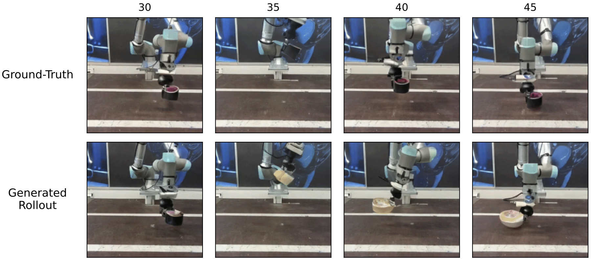
</p>

The useful part: the background does not drift away and the robot motion follows the provided actions over the shown horizon. The weak part is also visible: object identity becomes unstable during contact. The model learned robot kinematics more reliably than contact-rich object dynamics.

## Offline Planning

The planner encodes the current image and a goal image with DINOv2, samples candidate UR5 action sequences, rolls them out through the world model, and scores the terminal predicted state by DINO feature distance to the goal. The decoder is only used afterward to see what the selected latent plan looks like.

Before using DINO distance as a cost, I compared it with pixel MSE on a held-out UR5 sequence with brightness and contrast perturbations. Pixel distance was much more sensitive to photometric changes. DINO distance tracked progress toward the goal more smoothly.

<p align="center">
  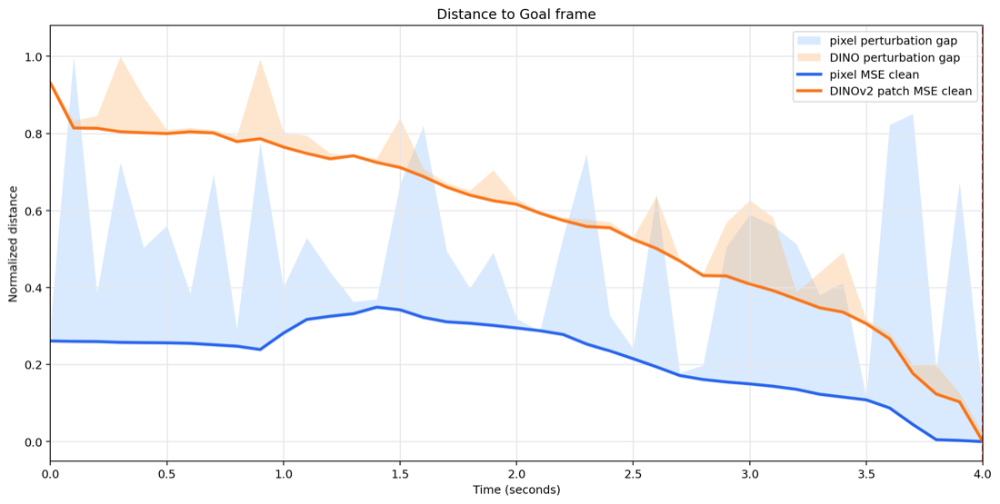
</p>

The CEM run shown in the thesis used 30 iterations, population 64, elite fraction 0.1, a 10-step action horizon, rollout signal level 0.8, 20 Euler denoising steps, and action penalty weight 0.2.

<table>
  <tr>
    <td align="center"><strong>CEM latent cost</strong></td>
    <td align="center"><strong>Terminal translation error</strong></td>
  </tr>
  <tr>
    <td>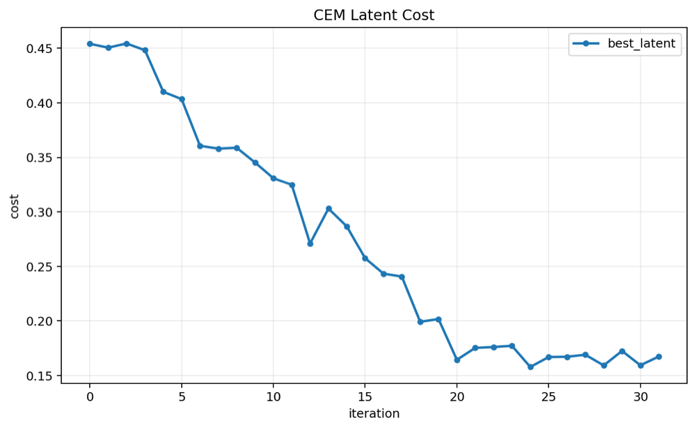</td>
    <td>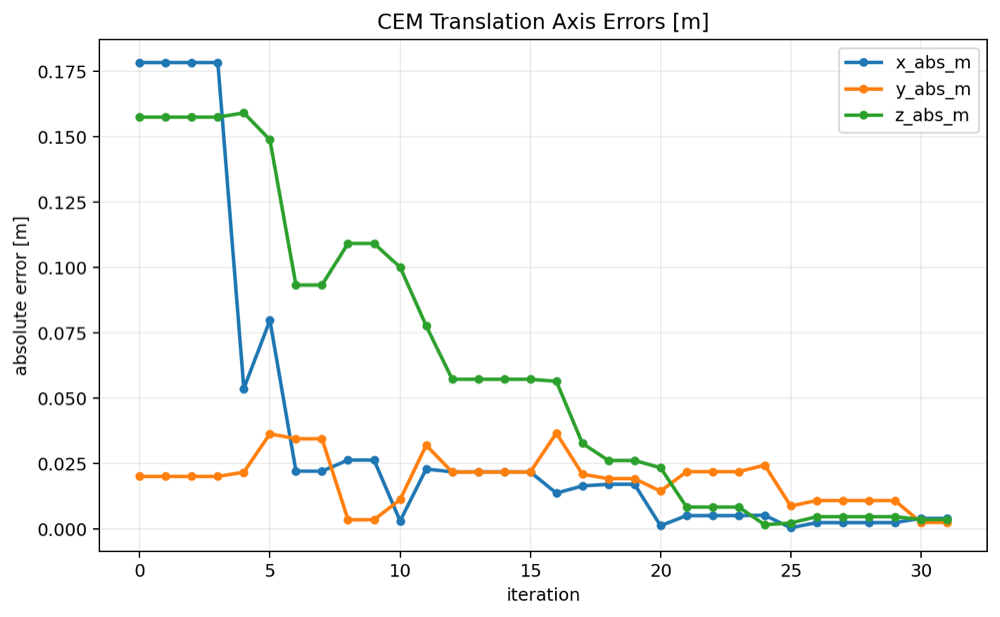</td>
  </tr>
</table>

The cost decreases, the sampling distribution contracts, and the final end-effector translation error reaches the centimeter to sub-centimeter range, with combined terminal translation error around 1 cm.

<p align="center">
  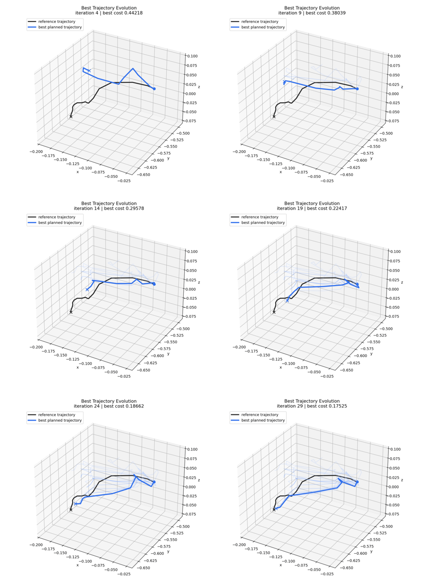
</p>

The decoded rollout below is the important sanity check: the optimized action sequence produces a coherent imagined motion toward the visual goal, not just a lower number in latent space.

<p align="center">
  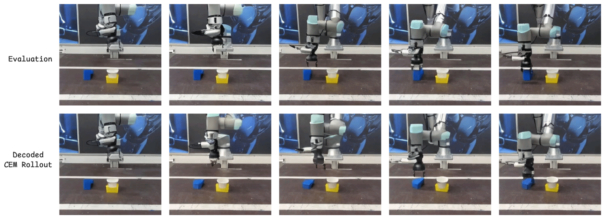
</p>

This is still offline planning. One illustrative CEM run took roughly two minutes on one H200 GPU, so the current diffusion planner is too slow for real-time control without distillation, fewer denoising steps, a learned action proposal, or another acceleration method.

## What This Shows

- Frozen DINOv2 features are a practical state space for visual robot world models.
- Mixed passive video and robot video reduced overfitting on a small UR5 dataset.
- Long-horizon rollout quality depended strongly on the signal schedule and feedback corruption level.
- DINO-space goal costs were meaningful enough for an offline CEM planner to find a visually coherent action sequence.
- The main failure mode is still object interaction: contact, occlusion, and small manipulated objects are harder than robot arm motion.

## Repository Map

| Path | Purpose |
|---|---|
| `src/world_model/` | Block-causal transformer backbone and autoregressive latent rollout |
| `src/diffusion/` | Signal-level schedules and Euler solver |
| `src/rae_dino/` | Frozen DINOv2 encoder and RAE decoder wrapper |
| `src/dataset/` | LeRobot-style dataset loading, mixing, padding, and action preprocessing |
| `src/training/` | Trainer, evaluator, logging, and distributed training utilities |
| `src/planning/` | CEM planner, action token builder, planning data loading, visualizations |
| `scripts/data/` | Dataset conversion utilities |
| `scripts/train_world_model.py` | Main world-model training entrypoint |
| `scripts/evaluate_checkpoint.py` | Held-out rollout evaluation |
| `scripts/plan_with_world_model.py` | Goal-conditioned CEM planning |
| `thesis/` | Thesis source, PDF, and original figures |

## Limitations

The planning results are offline diagnostics on held-out UR5 episodes, not closed-loop robot execution. The model is also still weak on contact-rich object interactions, and the planner is far too slow for direct real-time control. Those are the next engineering problems: faster sampling, better object-interaction modeling, and closed-loop validation on the robot.
