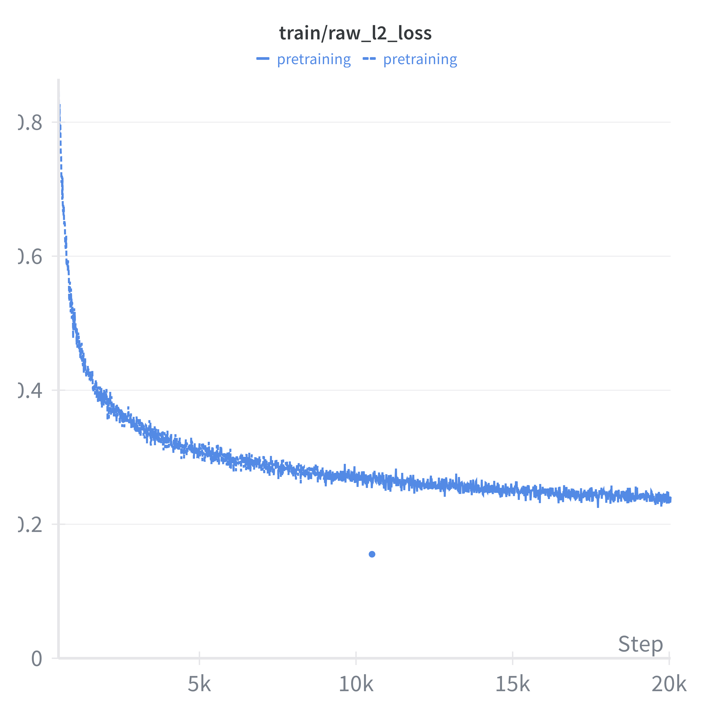
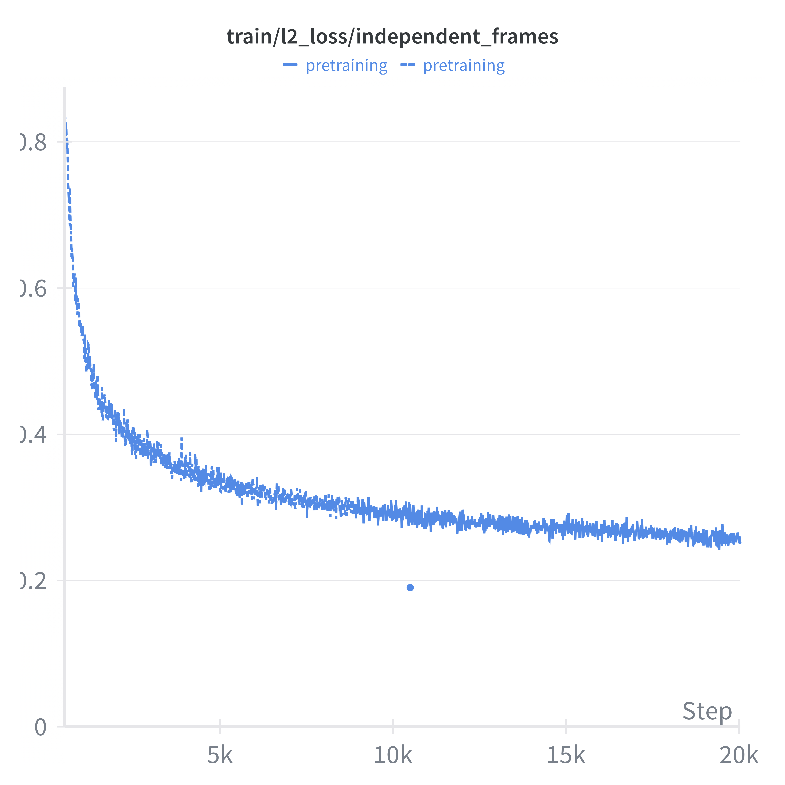
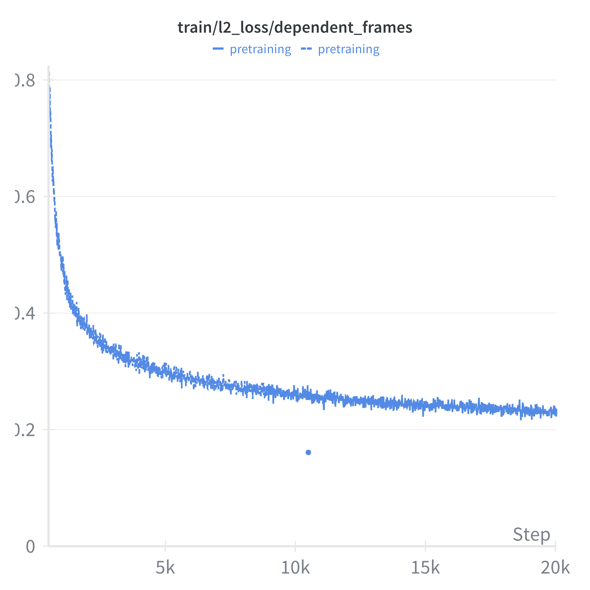
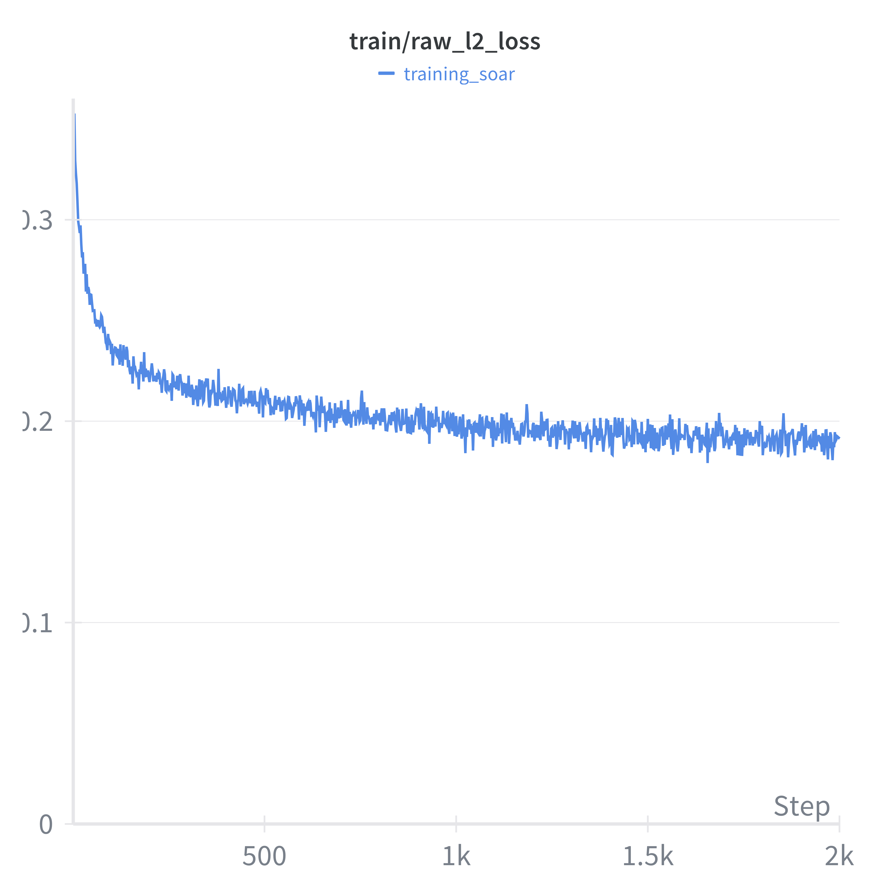
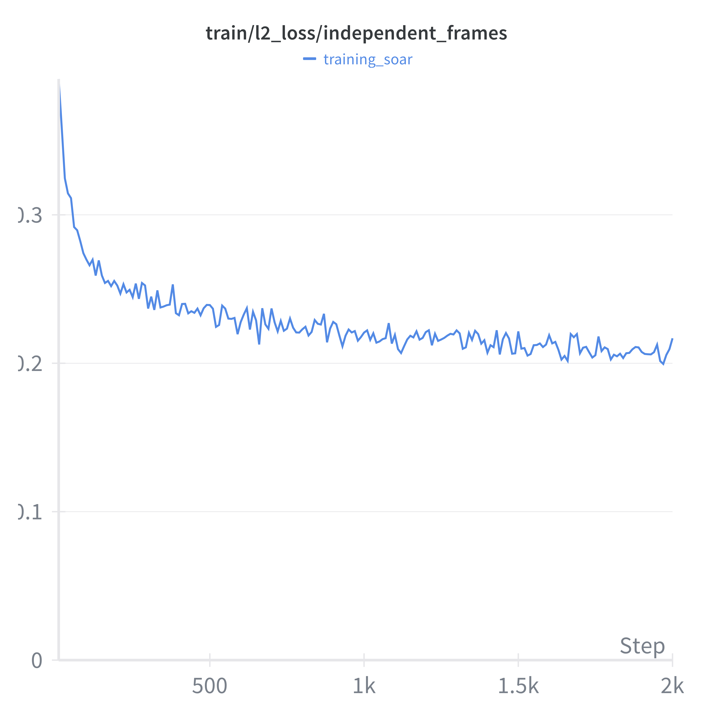
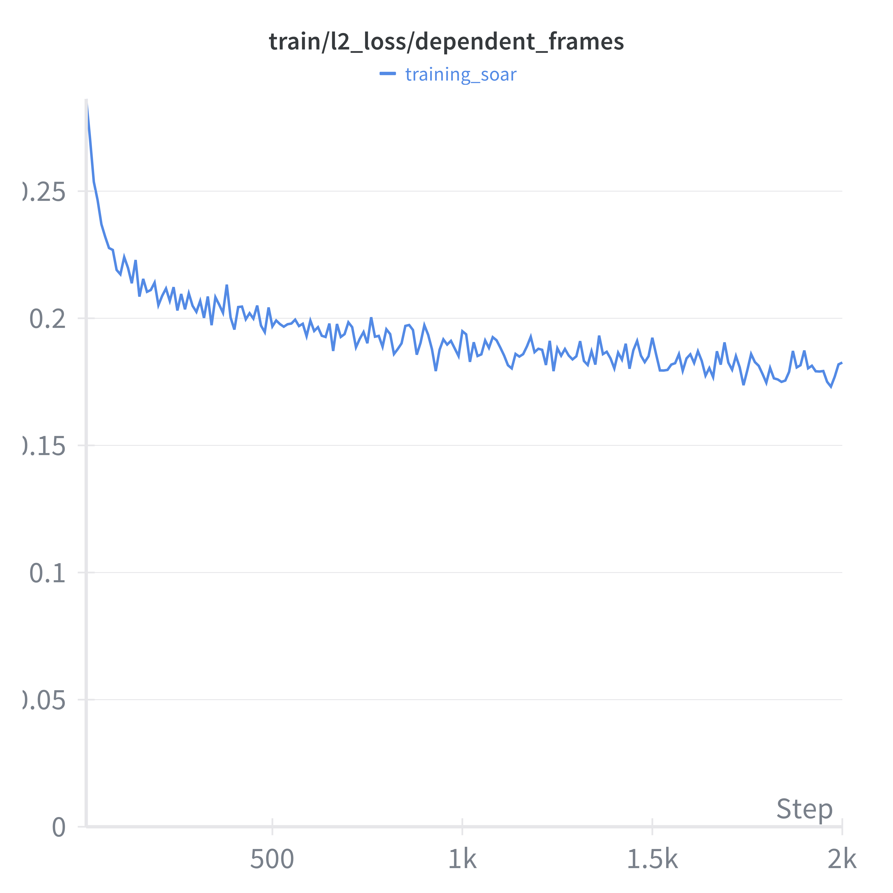
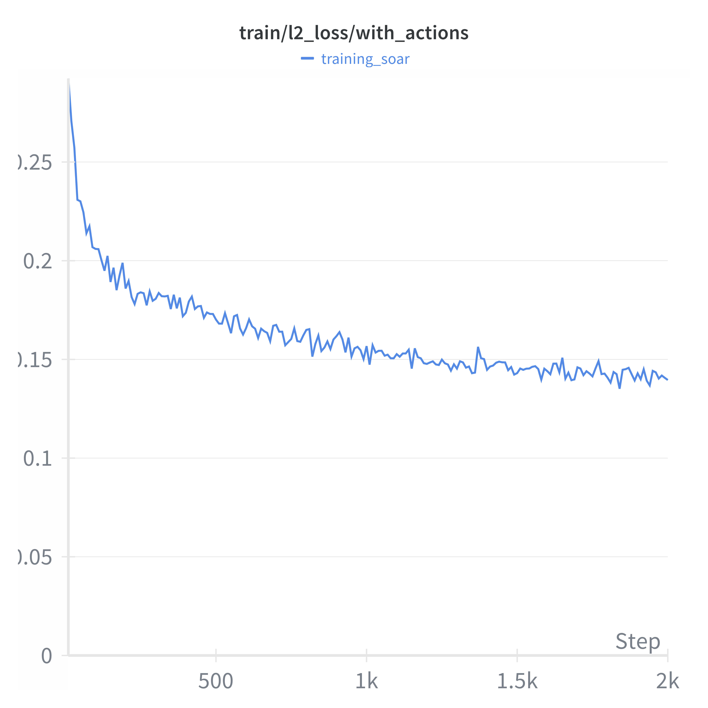
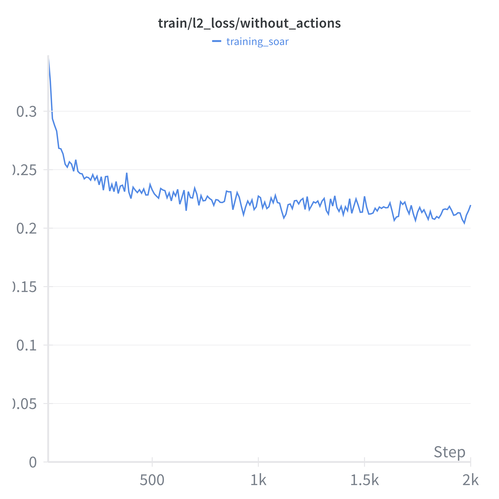
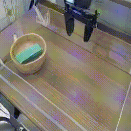

# Diffusion World Model for Robotics
*Master's Thesis (in progress)*

Building a latent world model that combines Dreamer V4 training with DINO representation encoder for robotic planning, goal-conditioned MPC and offline/model-based RL.
Learning general world dynamics and robot actions from large scale video datasets, both non-robot data and robot data.

## Research Foundations

- Image encoder/decoder -> Dinov2 RAE autoencoder, see paper [https://arxiv.org/abs/2510.11690]
- World model's architecture -> Dreamerv4, Spatial Temporal Transformer, see paper [https://arxiv.org/abs/2509.24527]
- World model's training objective -> Diffusion forcing, see paper [https://arxiv.org/abs/2407.01392]
- Model Predictive Control on dino features -> DINO-WM, see paper [https://arxiv.org/abs/2411.04983]

## Integrated Architecture

- Freeze the Dinov2 encoder and use MAE decoder from RAE paper (only for visualization purposes).
- Use the Dreamer V4 block-causal transformer, alternating spatial-only and temporal-only attention layers, QKNorm, attention logit soft capping, pre-layer RMSNorm, SwiGLU MLPs, and KV caching.
- Token sequence per step: `[timestep | actions | registers | dino latents]`

## Data

-  Learning diverse world dynamics -> EPIC-KITCHENS, BridgeV2, Droid
(Potential additions: Ego4D, Something-Something V2, EgoDex, agibot_alpha, OpenVid1M, HowTo100M)
-  Learning robot interactions + action conditioning with world -> SOAR

Converted datasets to lerobot format:
- [https://huggingface.co/datasets/Gaugou/BridgeV2]
- [https://huggingface.co/datasets/Gaugou/Soar]
- [https://huggingface.co/datasets/Gaugou/epic_kitchens_100]
- [https://huggingface.co/datasets/lerobot/droid_1.0.1]

---

## Early Results

### Pretraining

Pretrained on a mixture of diverse video datasets to learn general world dynamics:
- **BridgeV2** (30%) - Multi-camera robot manipulation
- **EPIC-KITCHENS** (50%) - Egocentric cooking videos  
- **DROID** (20%) - Large-scale robot demonstrations

| Config | Value |
|--------|-------|
| Model | 28-layer Spatial-Temporal Transformer (~800M params) |
| Batch Size | 256 |
| Sequence Length | 45 frames @ 5 FPS (9 seconds) |
| Training Steps | 20,000 (~83 hours on 4x h200) |
| Independant Frames Probability | 0.3 |
| Precision | BF16 |

📊 Loss Curves

<table>
<tr>
<td align="center"><strong>Total L2 Loss</strong></td>
<td align="center"><strong>Independent Frames</strong></td>
<td align="center"><strong>Dependent Frames</strong></td>
</tr>
<tr>
<td></td>
<td></td>
<td></td>
</tr>
</table>

### Fine-tuning on SOAR

Fine-tuned with action conditioning on the SOAR dataset:
- **SOAR** (70%) — with actions (90% action probability)
- **EPIC-KITCHENS** (20%) — no actions (maintains visual diversity)
- **DROID** (10%) — no actions

| Config | Value |
|--------|-------|
| Model | Same architecture, `use_action_token: true` |
| Batch Size | 256 |
| Sequence Length | 45 frames @ 5 FPS (9 seconds) |
| Training steps | 2,000 (~8 hours on 4x h200) |
| Independant Frames Probability | 0.3 |
| Action Probability (SOAR) | 0.9 |

📊 Loss Curves

<table>
<tr>
<td align="center"><strong>Total L2 Loss</strong></td>
<td align="center"><strong>Independent Frames</strong></td>
<td align="center"><strong>Dependent Frames</strong></td>
</tr>
<tr>
<td></td>
<td></td>
<td></td>
</tr>
</table>

<table>
<tr>
<td align="center"><strong>With Actions</strong></td>
<td align="center"><strong>Without Actions</strong></td>
</tr>
<tr>
<td></td>
<td></td>
</tr>
</table>

🎬 Action-Conditioned Rollout Examples

> The model receives 6 **initial frames** and the **same action sequence** as the ground truth episode.  
> This allows direct comparison between the real trajectory and the model's imagination (however, keeping in mind that errors accumulate).

#### Example 1 (Episode 15000)

<table>
<tr>
<td align="center"><strong>🎯 Ground Truth</strong></td>
<td align="center"><strong>🤖 Model Generated (with actions)</strong></td>
</tr>
<tr>
<td></td>
<td></td>
</tr>
</table>

#### Example 2 (Episode 25000)

<table>
<tr>
<td align="center"><strong>🎯 Ground Truth</strong></td>
<td align="center"><strong>🤖 Model Generated (with actions)</strong></td>
</tr>
<tr>
<td></td>
<td></td>
</tr>
</table>

---

## Todos

- MPC
- Offline model-based RL
- Separate WorldBatch and WorldBatchMetadata → cleaner, better for logs
- Shortcut forcing
- Dinov3 (training decoder using RAE codebase?)
- Add a DH head to backbone following RAE paper → RAE uses v-space prediction, and it is probably why DH head is so effective as explained in the JIT paper. This could be a good experiment to confirm the findings in JIT.